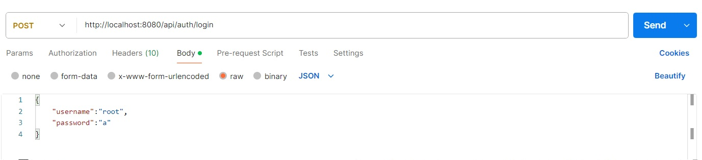
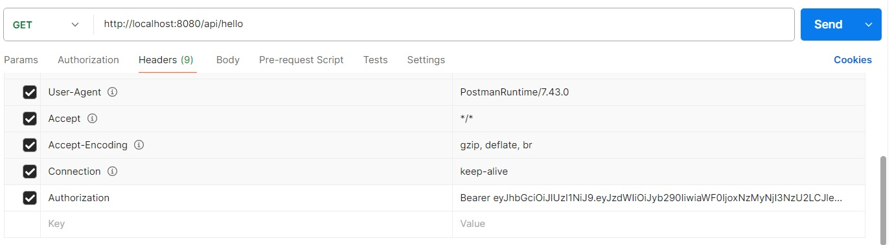

## Se connecter avec POSTMAN

### Mise en place
Créez une base de données de votre choix (exemple: myapp) puis modifiez le fichier application.properties  
Dans la table ROLE insérez un rôle nommé ADMIN et un autre nommé USER  
Insérez 2 utilisateurs dans la table USER et insérez les associations dans la table USER_ROLES. 

### Le modèle
La classe User a une association ManyToMany avec  Role.   
Le rôle a un nom par exemple ADMIN.  
  
Les méthodes sont sécurisées avec l'annotation et le nom du rôle autorisé.  
Exemple: @Secured("ADMIN")

### Se connecter   
Envoyer une requête POST sur /api/auth/login avec le JSON suivant dans le body :  

{  
    "username":"root",  
    "password":"a"  
}    

Attention, pour que cela fonctionne il faut que dans la table user le mdp soit la valeur de a encryptée avec BCryptPasswordEncoder
  
### Récupérer le jeton 
Le jeton est retourné dans le body de la réponse HTTP.  
Dans un contexte où vous utilisez POSTMAN, vous devez copier ce jeton.  
Dans un contexte où vous utilisez ANGULAR, vous devez récupérer ce jeton et le stocker dans le localStorage.  
  
```typescript
import { HttpClient } from '@angular/common/http';
import { Injectable } from '@angular/core';

@Injectable({
  providedIn: 'root',
})
export class AuthService {
  private readonly TOKEN_KEY = 'auth_token'; // Clé pour le localStorage

  constructor(private http: HttpClient) {}

  login(username: string, password: string) {
    return this.http.post<any>('/api/auth/login', { username, password }).pipe(
      tap((response) => {
        if (response.token) {
          this.saveToken(response.token); // Sauvegarde du token
        }
      })
    );
  }

  saveToken(token: string): void {
    localStorage.setItem(this.TOKEN_KEY, token);
  }

  getToken(): string | null {
    return localStorage.getItem(this.TOKEN_KEY);
  }

  logout(): void {
    localStorage.removeItem(this.TOKEN_KEY); // Supprime le token
  }
}
```
  
### Inclure le jeton JWT dans les requêtes
Une fois authentifié, vous devez récupérer le **token JWT** (manuellement en le copiant si vous utilisez POSTMAN).  
Vous devez ensuite **l'ajouter dans le header** de toutes les requêtes futures.  
Dans un contexte POSTMAN vous devez l'ajouter manuellement.  
    
**Ajouter la clé/valeur suivante dans le header :**  
**key**=Authorization  
**value**=Bearer {{valeur_jwt_token}}   
  
  
Il faut bien entendu remplacer {{valeur_jwt_token}} par sa valeur comme le montre l'exemple ci-dessus.  
  
**Pourquoi ajouter le mot Bearer dans la valeur de la clé ?**  
  
L’ajout du mot Bearer dans la valeur de la clé Authorization est une convention définie par le standard HTTP RFC 6750 pour indiquer que le client utilise un token porteur (bearer token) comme mécanisme d'authentification.  

### Comment gérer le token dans un contexte Angular 
Le token jwt doit être ajouté dans le header des requêtes HTTP via un intercepteur Angular.  
  
Intercepteur Angular:  
  
```typescript
import {
  HttpEvent,
  HttpHandler,
  HttpInterceptor,
  HttpRequest,
} from '@angular/common/http';
import { Injectable } from '@angular/core';
import { Observable } from 'rxjs';
import { AuthService } from './auth.service';

@Injectable()
export class JwtInterceptor implements HttpInterceptor {
  constructor(private authService: AuthService) {}

  intercept(req: HttpRequest<any>, next: HttpHandler): Observable<HttpEvent<any>> {
    const token = this.authService.getToken();

    if (token) {
      // Clone la requête et ajoute l’en-tête Authorization
      const clonedReq = req.clone({
        headers: req.headers.set('Authorization', `Bearer ${token}`),
      });
      return next.handle(clonedReq);
    }

    return next.handle(req);
  }
}
```  
Ajoutez l’intercepteur dans la configuration des providers de votre application :

Exemple dans app.module.ts :  
```typescript
import { HTTP_INTERCEPTORS } from '@angular/common/http';
import { JwtInterceptor } from './jwt.interceptor';

@NgModule({
  declarations: [/* vos composants */],
  imports: [/* vos modules */],
  providers: [
    {
      provide: HTTP_INTERCEPTORS,
      useClass: JwtInterceptor,
      multi: true,
    },
  ],
  bootstrap: [/* composant principal */],
})
export class AppModule {}
```